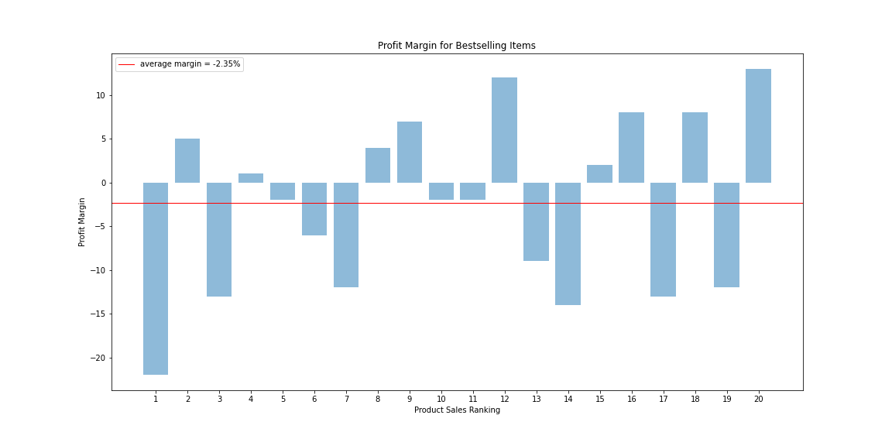
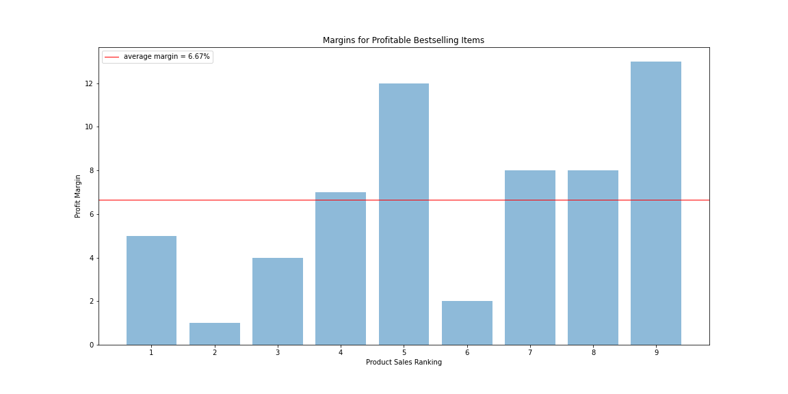
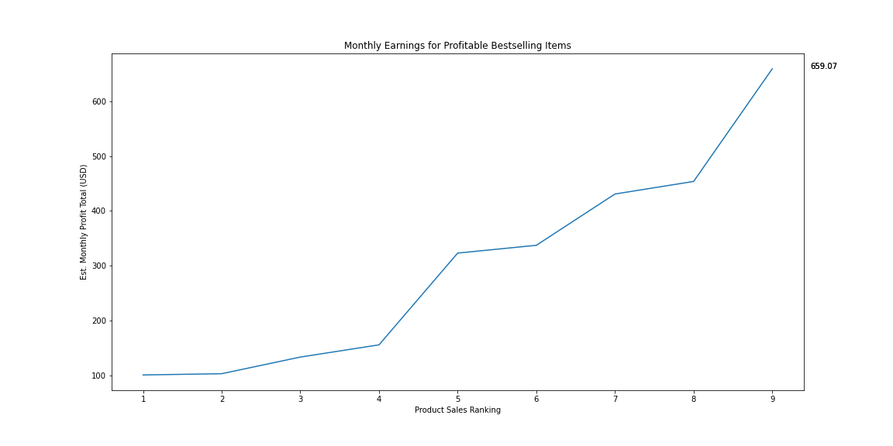
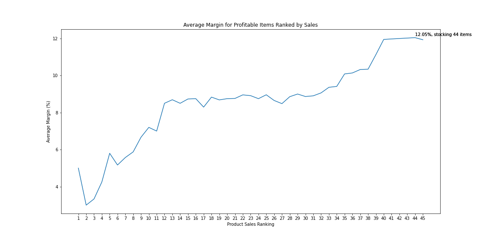
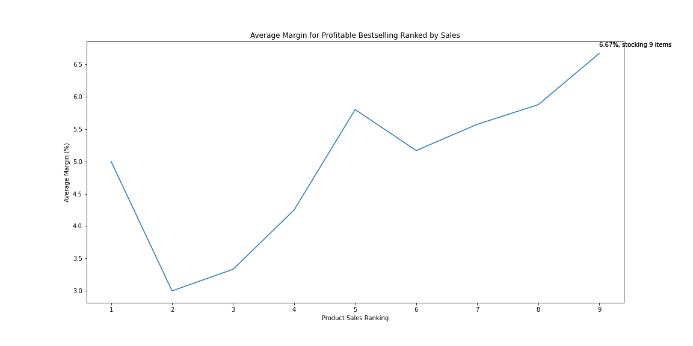
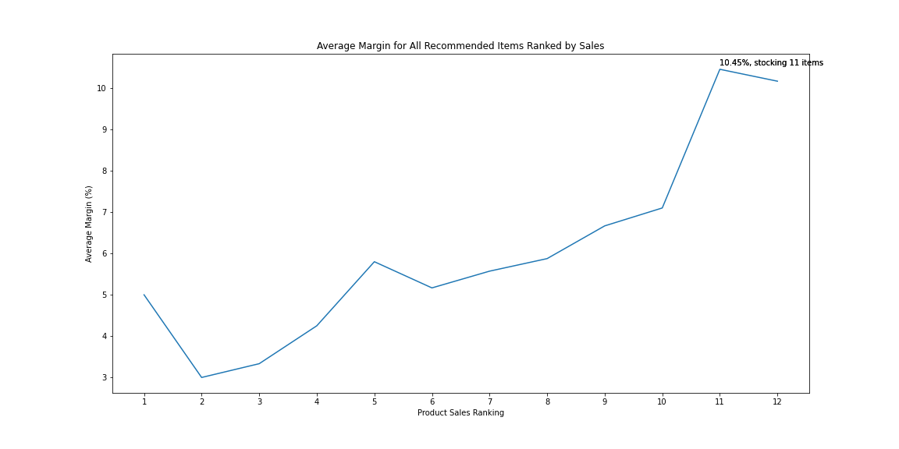

# Cold Steel Scouting Report

This report will evaluate and make recommendations about which Cold Steel products Connective Systems & Supply should stock.

## Description

Connective Systems & Supply is evaluating a new vendor, [Cold Steel Knife and Tool Company](https://www.coldsteel.com/), to determine which items CSS should stock. While Cold Steel specializes in knives and edged tools generally, not all of its offerings are suitable for CSS to carry since many items do not have direct application in the construction industry. Assuming it is important to maintain the CSS brand as a construction industry supplier, I begin by identifying the Cold Steel products with the highest possibility of construction industry application. Once properly scoped, I assume that CSS would like to test the waters with a new vendor first and so would prefer to act conservatively by stocking only those items that are likely to sell and likely to make a profit. Accordingly, I recommend stocking only profitable items from the top 20 best selling construction industry items from Cold Steel.

## Table of Contents

* [Repo Contents](#repo-contents)
* [Project Summary](#project-summary)
    * [Data](#data)
    * [Approach](#approach)
    * [Findings](#findings)
* [Authors](#authors)
* [Acknowledgments](#acknowledgments)
<!-- * [Getting Started](#getting-started)
    * [Dependencies](#dependencies)
    * [Installing](#installing)
    * [Executing program](#executing-program)
* [Help](#help) -->

<!-- * [Version History](#version-history)
* [License](#license) -->


## Repo Contents
This repo is organized into the following file structure:

* CSS Home Directory
    * README
    * [Data](https://github.com/jkurdys/CSS/tree/main/data) Directory: all source and output data saved as CSVs
        * source data `cold_steel.csv`
        * output data recommendations
    * [Images](https://github.com/jkurdys/CSS/tree/main/images) Directory: Explanatory charts from EDA notebook
    * [Notebooks](https://github.com/jkurdys/CSS/tree/main/notebooks) Directory: Exploratory Data Analysis with project walkthrough and findings

## Project Summary
Overview of the project's data, approach and findings. A complete description of the project can be found in the [EDA notebook.](notebooks/EDA.ipynb)

### Data
Project data originates with `cold_steel.csv`. The flat file contains 553 entries and 39 columns. Each record contains Cold Steel product information such as
* item name and description
* product identifiers (ASIN, UPC, Brand)
* physical description, packaging dimensions
* description of market competition for the item
* sales information
* price information
* costs and fee information
* pricing and profit estimates

As we are interested in identifying the appropriate items for CSS to stock, we focus on product identification, pricing and profit estimates using the following columns:
* Title
* ASIN
* Brand
* Product Group
* Sales Rank
* Est. Monthly Sales Share
* Est. Monthly Profit Share
* Est. Profit Margin
* Est. Profit per Item

### Approach
The approach consists of finding products that fit within the CSS brand as a supplier to the construction industry, prioritizing high sales volume to ensure rapid inventory turnover and further selecting profitable items among bestselling products to ensure returns from the investment in the new vendor relationship.

This approach assumes further that CSS would prefer to test the new vendor by selecting the fewest items that promise rapid sales and reasonable profit.

#### Construction Branding
Using information regarding product categories, keywords from competitor tool manufacturers and personal construction industry experience, I filtered the original 583 items down to 73 items with the most obvious application to the construction industry.

#### Bestsellers and Profits
Once the proper set of items appropriate for construction use is approximated, items can be sorted by their Sales Rank to effectively assess their popularity and likelihood of sale.

Reviewing only the top 20 best selling items from the group we see that many of the bestselling items have negative profit margins:



Not only does the set of the 20 bestselling items average to a loss margin of 2.35 percent, but if the items performed according to scouting report estimates, they would account for a monthly loss of more than $1300.


By contrast, further filtering the bestsellers by items that are estimated to turn a profit yields a positive profit margin of nearly 7 percent and an estimated monthly profit of nearly $700 by stocking nine of the twenty bestselling items.





#### Aggressive or Conservative?
The decision to limit the previous analysis to the top 20 bestselling items was arbitrarily made in order to show that indiscriminately selecting the bestselling products does not ensure profitability. Ultimately, the number of items to carry is a strategic business decision involving more than simple profit estimates.

If we were to simply take the profitable items from our construction industry scoped set of 73 items, that would leave us with 45 items to choose from. How many of those items would we want to carry to ensure the highest average profit margin? Nearly all of them:



Carrying 44 of 45 lines of profitable construction items would yield an average profit margin just over 12 percent compared to nearly 7 percent gained by stocking the nine profitable items from the 20 bestselling construction items.



**Selecting the items found in the `conservative_recs.csv` file represents the most conservative approach of stocking the fewest items with the highest likelihood of selling and producing a profit.**

A slightly more risky set of recommendations found in the `full_recs.csv` file includes additional items drawn from professional experience in construction and yields an average estimated profit margin of more than 10 percent.



### Findings
Although stocking nearly all of the profitable construction scoped items from Cold Steel offers the highest average profit margin of more than 12 percent, I still find it prudent to select a more conservative option that selects 12 product lines and achieves a more than 10 percent average profit margin.
Complete product information for these product lines can be found in the `data` directory as `full_recs.csv`

<!-- ## Getting Started

### Dependencies

* Describe any prerequisites, libraries, OS version, etc., needed before installing program.
* ex. Windows 10

### Installing

* How/where to download your program
* Any modifications needed to be made to files/folders

### Executing program

* How to run the program
* Step-by-step bullets
```
code blocks for commands
```

## Help

Any advise for common problems or issues.
```
command to run if program contains helper info
``` -->

## Authors

[Joshua Kurdys](https://www.linkedin.com/in/joshua-kurdys/)

<!-- ## Version History

* 0.2
    * Various bug fixes and optimizations
    * See [commit change]() or See [release history]()
* 0.1
    * Initial Release

## License

This project is licensed under the [NAME HERE] License - see the LICENSE.md file for details -->

## Acknowledgments

* [Connective Systems & Supply](https://www.connective-systems.com/)
* [Cold Steel Knife and Tool Company](https://www.coldsteel.com/)
* [Milwaukee Tool](https://www.milwaukeetool.com/)